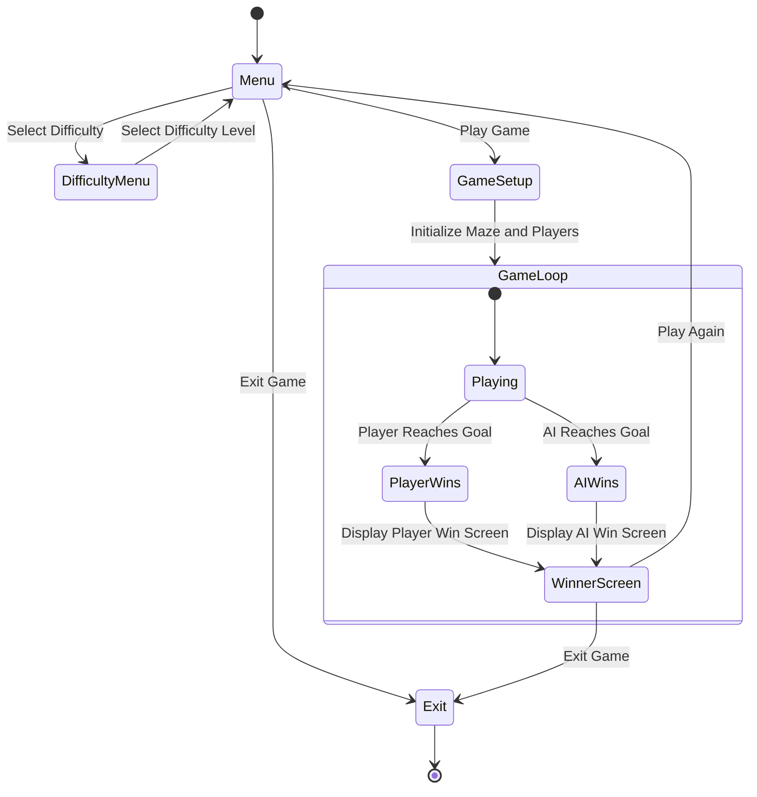
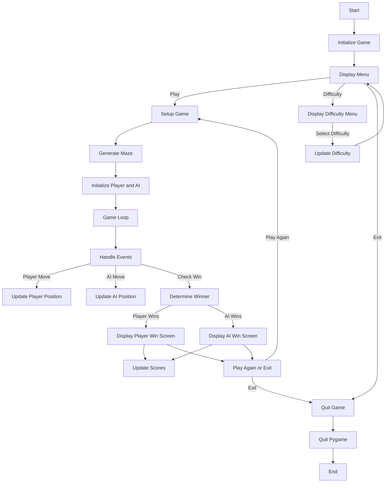

# Maze Runner

Maze Runner is a simple game where the player and an AI navigate a maze to reach the end. The player can choose the difficulty of the maze and the AI's intelligence. The player wins if they reach the end before the AI, and the AI wins if it reaches the end before the player.

<!-- Image of Game -->


# Installation
## Windows
1. Download the latest release from the [releases page](https://github.com/MuktadirHassan/maze-runner/releases/download/v1.0.0/main.exe).
2. Run the executable file.


# Development
## Installation
```bash
# Python 3.12.3
# pip 24.0

pip install -r requirements.txt
```

## Usage
```bash
python main.py
```

## State Diagram


## Program Flow

